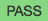
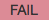
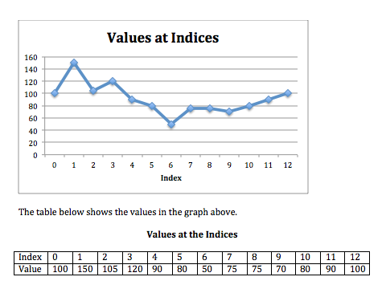

.. qnum::
   :prefix: 1-4-
   :start: 1
   
.. |runbutton| image:: Figures/run-button.png
    :height: 20px
    :align: top
    :alt: run button   
    

    

    
.. |start| image:: Figures/start.png
    :height: 24px
    :align: top
    :alt: start
    
.. |finish| image:: Figures/finishExam.png
    :height: 24px
    :align: top
    :alt: finishExam
    
.. |right| image:: Figures/rightArrow.png
    :height: 24px
    :align: top
    :alt: right arrow for next page
            

Post-test 2 Write Code Problem
--------------------------------

Finish writing the ``isStableSeg(numList,first,last)`` function which returns ``True`` when the values in the data segment are stable and ``False`` otherwise. 
A data segment is defined by all the indicies from the first index to the last index (including the first and last indicies). The parameters of the method are the list of numbers, the first index, and the last index.

The method should return true if the difference
between the largest value and the smallest value in the data segment is less than or equal to
10.  To determine if this is a stable segment, first set the largest and smallest values to the value at the first index. Loop from the first index to the last index (inclusive).  If the value at the current index is less than the smallest, set the smallest to the current value.  If the value at the current index is greater than the largest, set the largest to the current value.  Return true if the difference between the largest and smallest is less than or equal to ten, otherwise return false.

Examples
============

For the data shown in Figure 1 below, the data segment starting at index 7 and ending at index 9 has values ranging from 70 to 75.  Because the difference between 75 and 70 is less than 10 it is considered stable.  The data segment starting at index 7 and ending at
index 10 has values ranging between 70 and 80. Because the difference between 80 and 70 is
equal to 10, the data segment is also considered stable.
The data segment starting at marker 2 and ending at marker 12 has values ranging between 50 and
120 meters. Because the difference between 120 and 50 is greater than 10, this trail segment is not considered level.

    Figure 1: The data values as a graph and as a table

See the table below for a summary of the examples above.  

======= ===== =======  ====== ================  ===========
 Start   End    Max     Min   Difference <= 10   is Stable?
======= ===== =======  ====== ================  ===========
   7      9      75      70          5			  True
   7     10      80      70         10            True
   2     12     120      50         70            False
======= ===== =======  ====== ================  ===========

Write Code Here
================
    
Finish writing the ``isStableSeg(numList,first,last)`` function below so that the code compiles and all tests print |pass| when you click the |runbutton| button.

Click on the |start| button below when you are ready to try to finish writing this code.  You will have up to 10 minutes to try to write it.  Click on the |finish| button when you have solved this problem or wish to move on without solving it.
       
.. timed:: post_test2_is_level_timed
   :timelimit: 10
   :noresult:
   :nofeedback:
   
   .. activecode:: Post_Test2_Is_Stable
   
      # write the isStableSeg function below
      # It should take a list of numbers, a first index, 
      # and a last index
      # It should find the smallest value and largest value
      # between the first and the last index and return true if the 
      # difference between the largest value and the smallest
      # values between the first and last index (inclusive) is 
      # less than or equal to 10 and return false otherwise
      def isStableSeg(numList, first, last):
      
      ====

      # code to test the isLevelTrailSegment function
      from unittest.gui import TestCaseGui

      class myTests(TestCaseGui):

          def testOne(self):
              nums = [100, 150, 105, 95, 95, 90, 50, 75, 75, 70, 80, 90, 100]
              self.assertEqual(isStableSeg(nums,7,9),True,"The data segment from index 7 to 9 should be stable")
              self.assertEqual(isStableSeg(nums,7,10),True,"The data segment from index 7 to 10 should be stable")
              self.assertEqual(isStableSeg(nums,2,12),False,"The data segment from index 2 to 12 should not be stable")
              self.assertEqual(isStableSeg(nums,7,11),False,"The data segment from index 7 to 11 should not be stable")
		   
      myTests().main()
   
You have finished the materials!  Thank you for taking the time to answer the questions. 